# HavenBridge Incident Simulation

This directory documents controlled HavenBridge failure scenarios performed
during Observability Phase 8.

The purpose of these simulations is to validate the operational workflow:

```text
Detect
  ↓
Observe
  ↓
Investigate
  ↓
Correlate metrics + logs + Kubernetes state
  ↓
Identify root cause
  ↓
Recover
  ↓
Verify
  ↓
Document
```

Each scenario preserves the failure-injection command, Kubernetes state,
Grafana observations, application behavior, recovery steps and screenshots.

---

## Incident 1 — Degraded HavenBridge API Replica Availability

### Scenario

The HavenBridge API normally runs with two replicas distributed across the two
Kubernetes worker nodes.

Normal state:

```text
havenbridge-api
        ↓
2 replicas
        ↓
eph-worker01
eph-worker02
        ↓
HEALTHY
```

The Deployment was intentionally reduced from two replicas to one.

The goal was to validate whether:

- HavenBridge remained externally available;
- Grafana detected the loss of redundancy;
- the remaining replica continued serving requests;
- HTTP 5xx errors remained absent;
- an incorrect full-outage alert was avoided; and
- the application could be restored cleanly.

---

### Before — Healthy Baseline

Before introducing the failure, the HavenBridge API Deployment reported:

```text
READY       2/2
UP-TO-DATE  2
AVAILABLE   2
```

One API Pod was running on each worker node.

External application validation from `syrus` returned:

```text
HTTP 200
```

The healthy dashboard state is shown below.

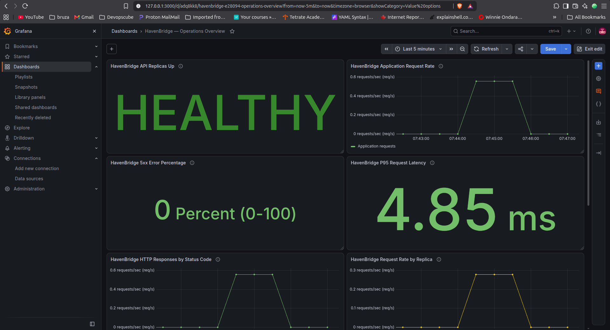

The supporting dashboard panels also showed no active alerts and no recent
container restarts.

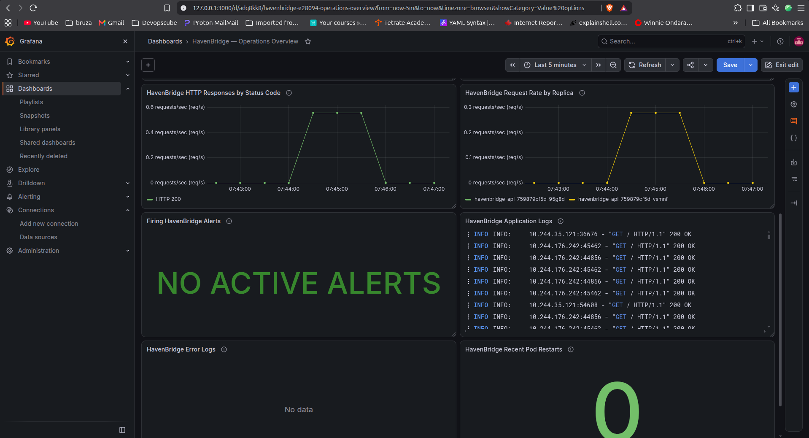

The healthy baseline established:

```text
API replicas       → HEALTHY
HTTP availability  → HTTP 200
5xx errors         → 0%
alerts             → none
recent restarts    → 0
```

---

### Failure Injection

The HavenBridge API Deployment was intentionally scaled from:

```text
2 replicas
```

to:

```text
1 replica
```

On `eph-cp01`:

```bash
kubectl -n havenbridge scale deployment havenbridge-api --replicas=1
```

The Deployment then settled at:

```text
READY       1/1
UP-TO-DATE  1
AVAILABLE   1
```

The application continued responding externally because one healthy API
replica remained available.

---

### During — Grafana Detects Degradation

The Operations Overview dashboard changed the API state from:

```text
HEALTHY
```

to:

```text
DEGRADED
```

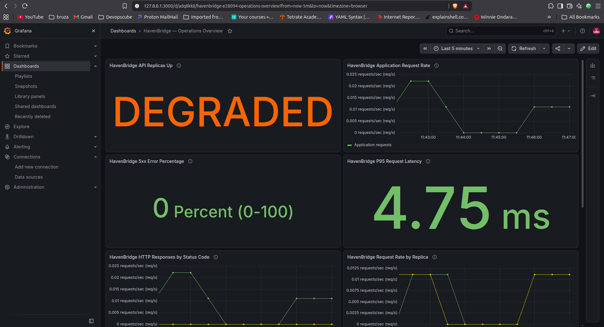

At the same time:

```text
5xx Error Percentage
    → 0%

P95 Request Latency
    → remained healthy

Application Request Rate
    → application remained capable of serving traffic
```

This demonstrated:

```text
loss of redundancy
        ≠
complete application outage
```

---

### During — Alerts and Application Logs

The lower dashboard panels showed:

```text
Firing HavenBridge Alerts
    → NO ACTIVE ALERTS

HavenBridge Recent Pod Restarts
    → 0
```

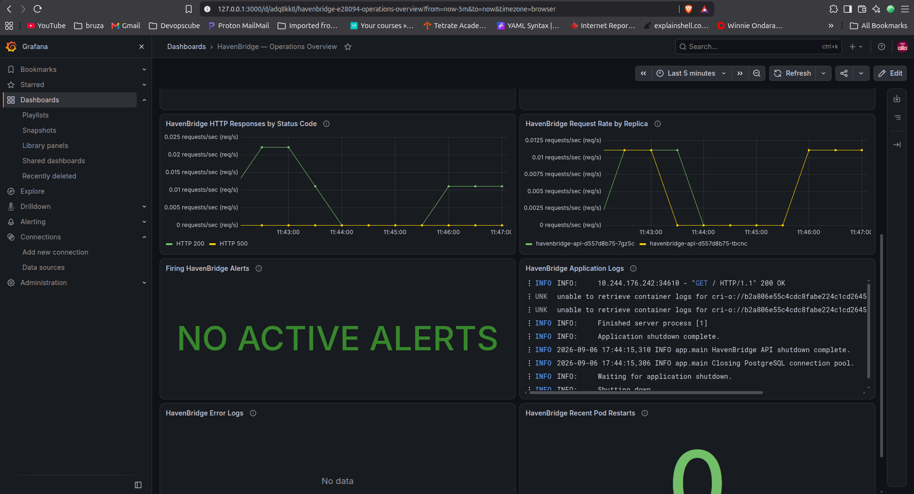

The application logs recorded the graceful shutdown of the removed replica.

No full availability alert fired because one healthy replica remained
available.

This was the expected behavior:

```text
1 healthy replica
        ↓
service remains available
        ↓
DEGRADED

not

UNAVAILABLE
```

---

### During — Single Replica Traffic

The `HavenBridge Request Rate by Replica` panel showed only one active API Pod.

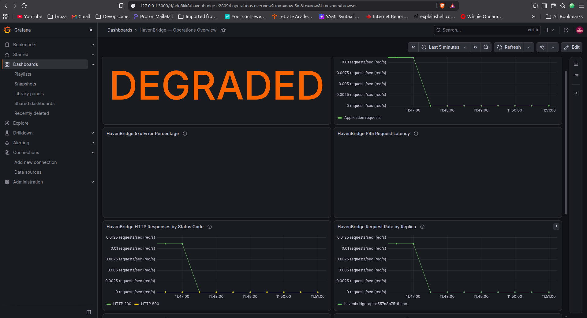

The operational state was therefore:

```text
Before
    ↓
Replica 1 + Replica 2

During degradation
    ↓
Replica 1 only
```

The remaining replica continued serving HavenBridge traffic.

This confirmed that Kubernetes service routing continued operating correctly
while application redundancy was reduced.

---

### Operational Interpretation

The incident demonstrated three distinct application states:

```text
2 replicas
    ↓
HEALTHY

1 replica
    ↓
DEGRADED

0 replicas
    ↓
UNAVAILABLE
```

A degraded application still has serving capacity, but redundancy has been
lost.

This is operationally significant because an additional failure while only one
replica remains could result in complete HavenBridge API unavailability.

---

### Recovery

The HavenBridge API Deployment was restored to two replicas.

On `eph-cp01`:

```bash
kubectl -n havenbridge scale deployment havenbridge-api --replicas=2
```

The rollout was validated with:

```bash
kubectl -n havenbridge rollout status \
  deployment/havenbridge-api \
  --timeout=180s
```

The recovered Deployment returned to:

```text
READY       2/2
UP-TO-DATE  2
AVAILABLE   2
```

External application validation from `syrus` returned:

```text
HTTP 200
```

---

### After — Healthy State Restored

Grafana returned the application state to:

```text
HEALTHY
```

Normal application traffic was visible again.

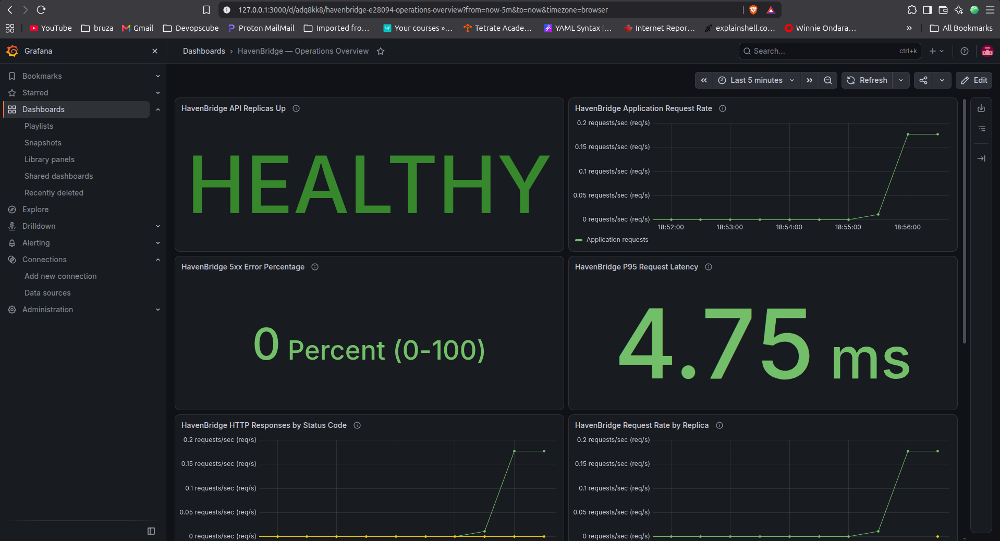

The recovered dashboard showed:

```text
API replica health
    → HEALTHY

5xx Error Percentage
    → 0%

P95 latency
    → healthy

application traffic
    → present
```

The lower dashboard panels confirmed both replica activity and a clean
operational state.

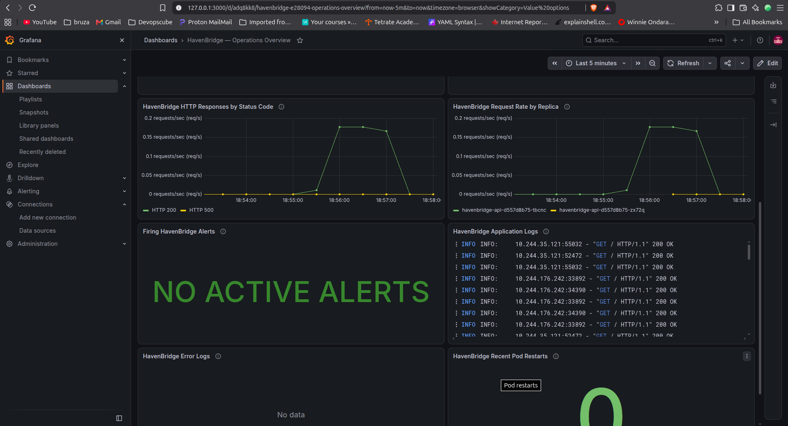

Observed recovery state:

```text
Request Rate by Replica
    → two replicas visible

Firing HavenBridge Alerts
    → NO ACTIVE ALERTS

Application Logs
    → successful HTTP 200 requests

HavenBridge Error Logs
    → no active application errors

HavenBridge Recent Pod Restarts
    → 0
```

---

### Incident Result

```text
Healthy baseline confirmed                    PASS
API scaled from 2 replicas to 1               PASS
Grafana changed HEALTHY → DEGRADED            PASS
Application remained externally available     PASS
HTTP 5xx percentage remained 0%               PASS
No false API-unavailable alert fired          PASS
Single remaining replica remained observable  PASS
Graceful shutdown logs captured               PASS
No recent container restart introduced        PASS
API restored from 1 replica to 2              PASS
Grafana returned DEGRADED → HEALTHY           PASS
External HTTP 200 recovery confirmed          PASS
No active alert after recovery                PASS
```

### Final Outcome

Incident 1 demonstrated that HavenBridge can distinguish a reduction in
application redundancy from a complete service outage.

The remaining API replica continued serving requests while Grafana correctly
reported a degraded state.

After the Deployment was restored to two replicas, HavenBridge returned to the
healthy operational state without HTTP 5xx errors, active alerts or container
restarts.

---


## Incident 2 — Complete HavenBridge API Unavailability

### Scenario

This incident simulated complete HavenBridge API unavailability by scaling the
API Deployment from two replicas to zero.

The purpose was to validate the complete outage path:

```text
2 healthy API replicas
        ↓
scale Deployment to 0
        ↓
no API Pods
        ↓
EndpointSlice has no backend endpoints
        ↓
external request returns HTTP 503
        ↓
Grafana reports DOWN
        ↓
HavenBridgeAPIUnavailable
        ↓
Alertmanager
        ↓
Slack + Discord
        ↓
restore 2 replicas
        ↓
HEALTHY
```

---

### Before — Healthy Baseline

Before failure injection:

```text
Deployment
    READY       2/2
    UP-TO-DATE  2
    AVAILABLE   2

API Pods
    eph-worker01 → Running
    eph-worker02 → Running

External application request
    HTTP 200
```

Grafana showed the normal healthy state.

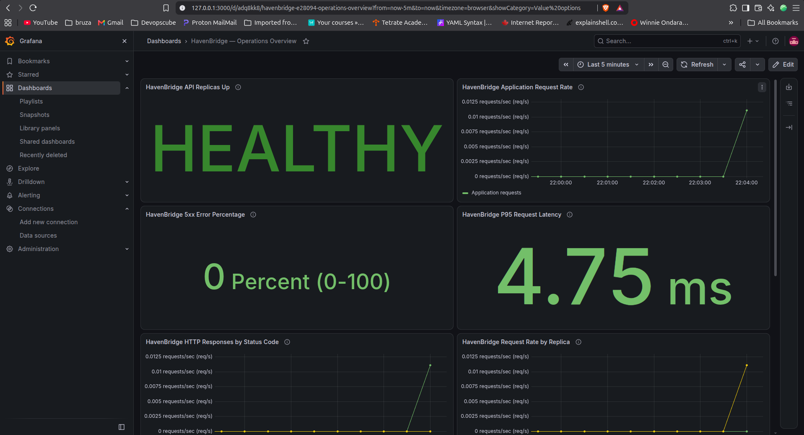

The supporting panels showed no active alerts and no recent container restarts.

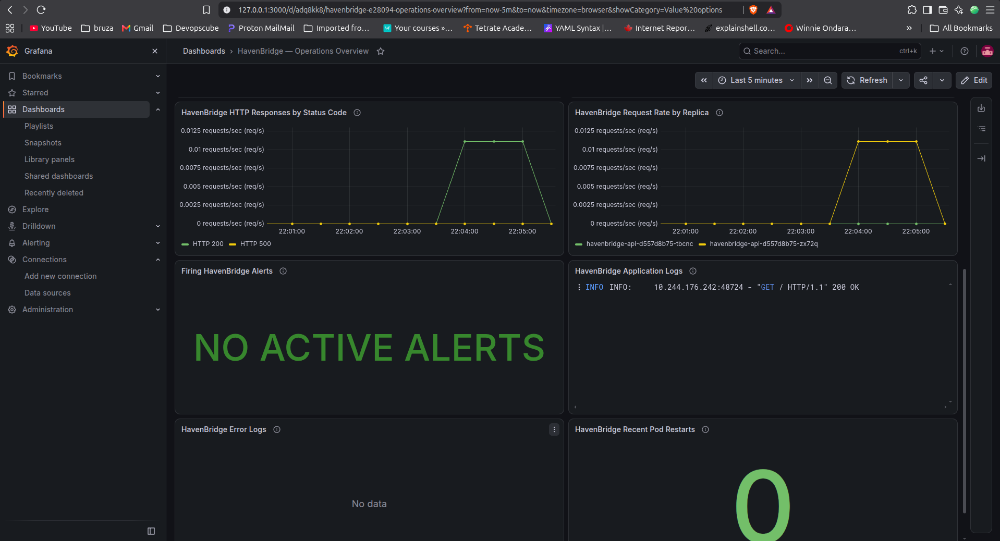

---

### Failure Injection

On `eph-cp01`:

```bash
kubectl -n havenbridge scale deployment havenbridge-api --replicas=0
```

After Kubernetes completed the scale-down:

```text
READY       0/0
UP-TO-DATE  0
AVAILABLE   0
```

The HavenBridge API EndpointSlice existed, but contained no backend endpoints.

Observed:

```text
NAME                    PORTS     ENDPOINTS
havenbridge-api-b97n6   <unset>   <unset>
```

This meant the Kubernetes Service still existed, but there were no application
Pods available to receive requests.

---

### External Availability Failure

From `syrus`:

```bash
curl -sS -o /dev/null \
  -w 'HTTP %{http_code}\n' \
  https://havenbridge.lab/
```

Observed:

```text
HTTP 503
```

The routing path was:

```text
Client
  ↓
Traefik
  ↓
HTTPRoute
  ↓
havenbridge-api Service
  ↓
EndpointSlice
  ↓
NO API endpoints
  ↓
HTTP 503 Service Unavailable
```

The HTTP 503 was returned by the routing layer because Traefik had no healthy
HavenBridge API backend endpoint to forward the request to.

The request did not reach FastAPI.

---

### During — Complete API Outage

Grafana changed the application state to:

```text
DOWN
```

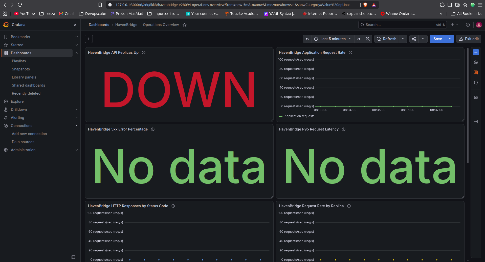

The dashboard also showed:

```text
Application Request Rate
    → 0

5xx Error Percentage
    → No data

P95 Request Latency
    → No data

Request Rate by Replica
    → no active replicas
```

`No data` for the application-level metrics was expected.

The HavenBridge request counter and latency histogram are emitted by the
FastAPI processes themselves.

With zero API Pods:

```text
no FastAPI process
        ↓
no application metric target
        ↓
no request counter samples
        ↓
no latency histogram samples
        ↓
No data
```

---

### Why the HTTP 503 Did Not Appear as an API 5xx Metric

Although the external request returned HTTP 503, the request never reached the
HavenBridge API.

Therefore:

```text
Traefik returned HTTP 503
```

but there was no running application process available to increment:

```text
havenbridge_http_requests_total
```

This is different from the controlled `/test/500` scenario.

```text
/test/500
    ↓
request reaches FastAPI
    ↓
FastAPI returns HTTP 500
    ↓
application records the 500 metric
```

During this outage:

```text
request never reaches FastAPI
    ↓
routing layer returns HTTP 503
    ↓
application cannot record the request
```

This explains why the 5xx percentage displayed `No data` rather than an HTTP
503 error percentage.

---

### Alert Transition

Initially the dashboard showed no firing alert while the Prometheus rule's
configured duration had not yet elapsed.

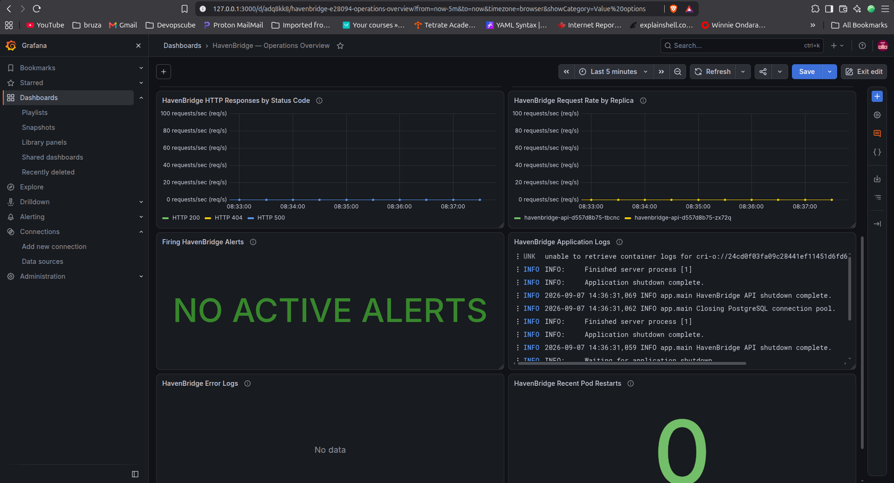

The availability rule evaluates:

```text
Check the HavenBridge API targets.

If:
  every API target is down

OR:
  Prometheus cannot find the API targets at all

and the problem lasts at least 2 minutes,

fire:

HavenBridgeAPIUnavailable

with severity:

critical
```

After the outage remained active for the required duration, the dashboard
showed:

```text
Firing HavenBridge Alerts
    → 1
```

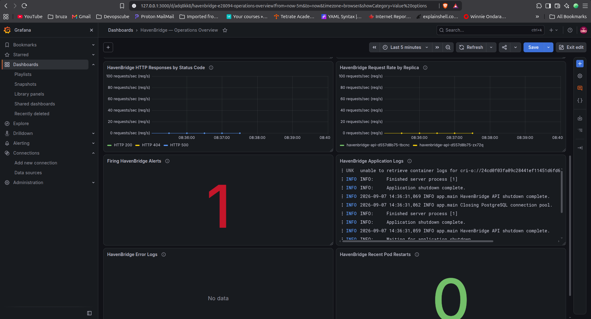

The alert was:

```text
HavenBridgeAPIUnavailable
Severity: critical
```

---

### Alertmanager Notification Delivery

Alertmanager successfully delivered the critical firing notification to
Discord.

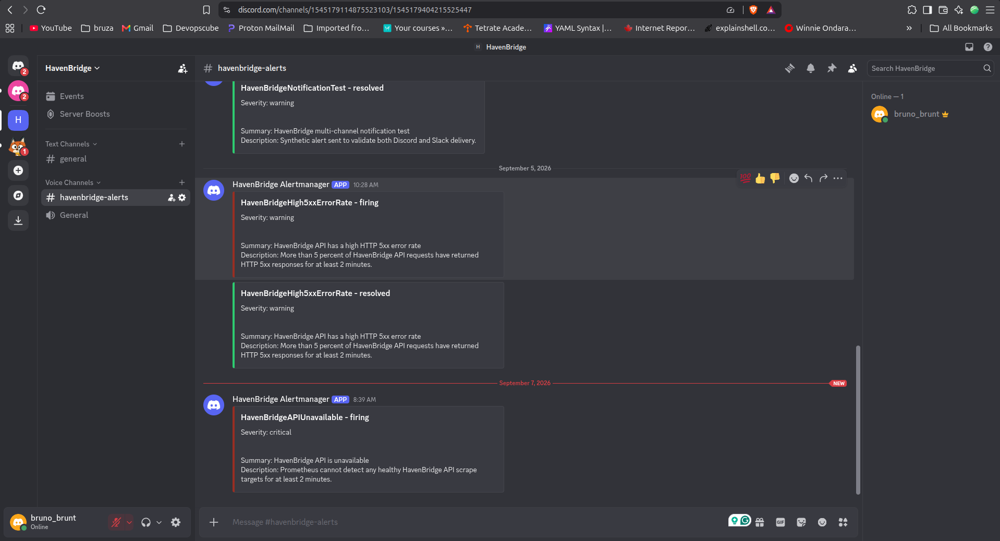

Slack also received the firing notification.

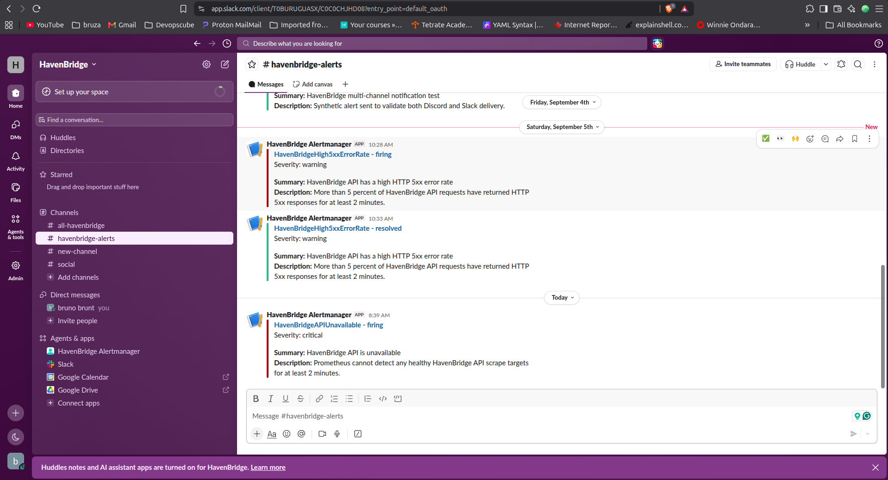

This validated:

```text
Prometheus
    ↓
HavenBridgeAPIUnavailable
    ↓
Alertmanager
    ├── Discord
    └── Slack
```

---

### Recovery

The HavenBridge API Deployment was restored to two replicas.

On `eph-cp01`:

```bash
kubectl -n havenbridge scale deployment havenbridge-api --replicas=2
```

Recovery was validated with:

```bash
kubectl -n havenbridge rollout status \
  deployment/havenbridge-api \
  --timeout=180s
```

The Deployment returned to:

```text
READY       2/2
UP-TO-DATE  2
AVAILABLE   2
```

The EndpointSlice was repopulated with backend Pod addresses.

External validation from `syrus` returned:

```text
HTTP 200
```

---

### After — API Healthy Before New Traffic

Immediately after the replicas returned, Grafana already detected:

```text
API Replicas Up
    → HEALTHY
```

but several application metrics temporarily displayed:

```text
No data
```

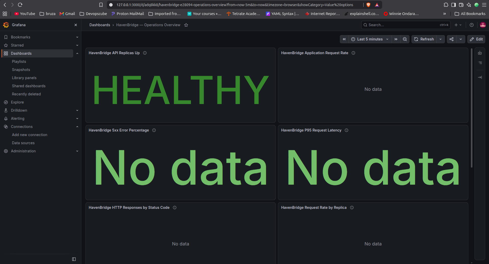

This occurred because the newly started FastAPI processes had not yet handled
enough application traffic for the rate and histogram queries to produce
useful values.

The alert state had also returned to:

```text
NO ACTIVE ALERTS
```

and application startup logs were visible.

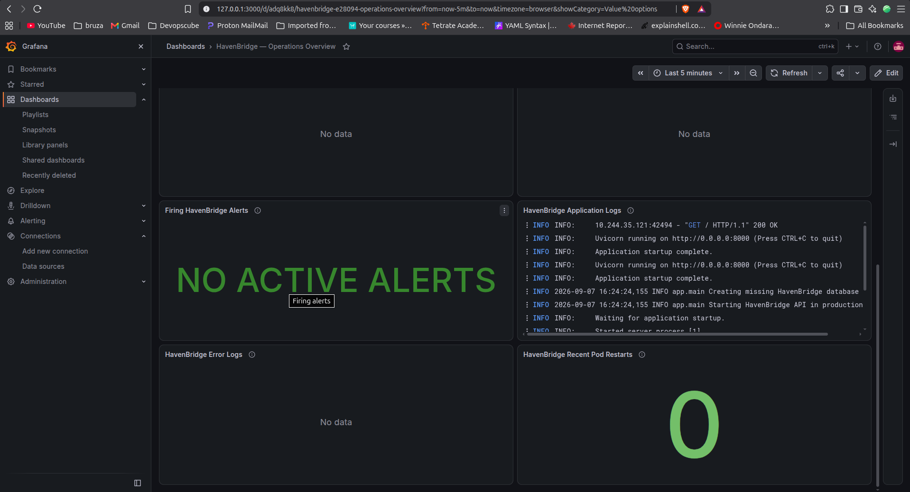

---

### Recovery Traffic Validation

Normal application traffic was generated from `syrus`:

```bash
for i in {1..30}; do
  curl -s https://havenbridge.lab/ > /dev/null
done
```

After Prometheus scraped the newly generated metrics:

```text
5xx Error Percentage
    → 0%

P95 Request Latency
    → populated and healthy

HTTP Responses
    → HTTP 200 visible

Request Rate by Replica
    → application traffic visible again
```

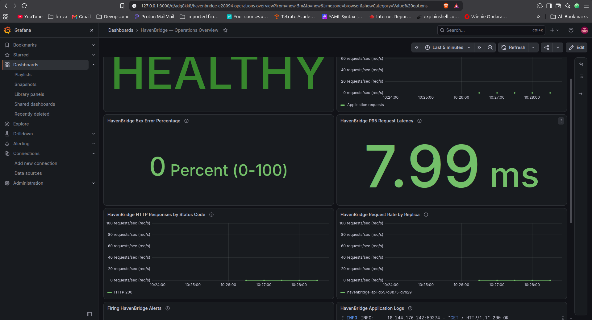

The full Operations Overview returned to a healthy operating state.

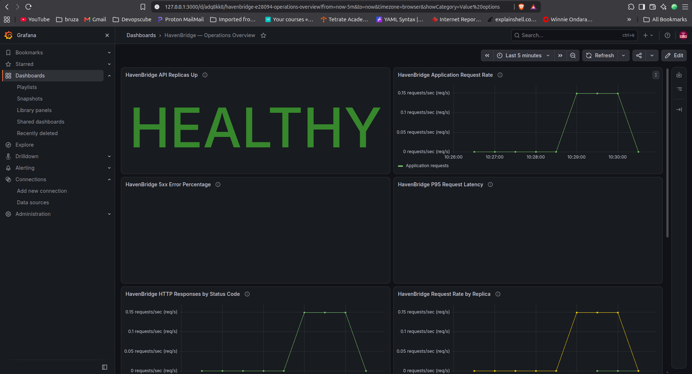

Both replicas were visible again and no alert remained active.

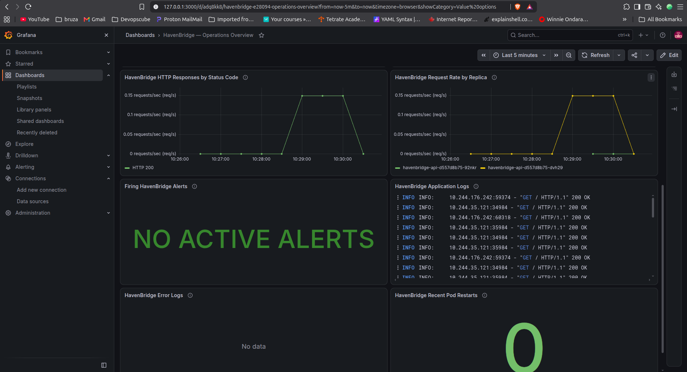

---

### Firing Alert Panel Behavior

The `Firing HavenBridge Alerts` panel uses an Instant Prometheus query.

It answers:

```text
How many HavenBridge alerts are firing right now?
```

It does not show historical alert state.

During the outage the panel correctly displayed:

```text
1
```

After recovery it returned to:

```text
NO ACTIVE ALERTS
```

The earlier firing state is preserved through the incident screenshots,
Prometheus/Alertmanager evidence and Slack/Discord notification history rather
than by the current-state Stat panel.

---

### Resolved Notifications

Slack received the resolved critical notification after the API recovered.

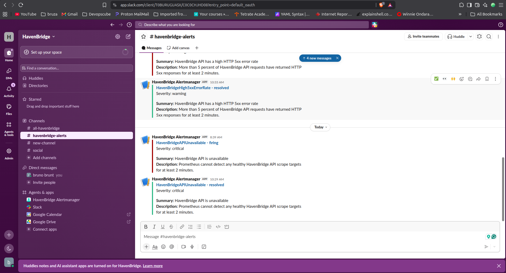

Discord also received the resolved notification.

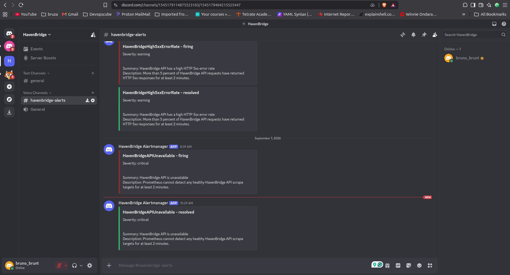

The complete alert lifecycle was therefore:

```text
API healthy
    ↓
0 replicas
    ↓
alert pending
    ↓
alert firing
    ↓
Slack + Discord firing
    ↓
2 replicas restored
    ↓
Prometheus detects recovery
    ↓
alert healthy
    ↓
Slack + Discord resolved
```

---

### Incident Result

```text
Healthy 2/2 baseline confirmed                    PASS
Deployment scaled from 2 → 0                      PASS
API Pods removed                                  PASS
EndpointSlice lost backend endpoints              PASS
External HTTP 503 confirmed                       PASS
Grafana changed HEALTHY → DOWN                    PASS
No-data application metric behavior explained     PASS
HavenBridgeAPIUnavailable entered firing state    PASS
Critical alert visible in Grafana                 PASS
Discord firing notification received              PASS
Slack firing notification received                PASS
Deployment restored from 0 → 2                    PASS
EndpointSlice repopulated                         PASS
External HTTP 200 recovery confirmed              PASS
Grafana returned DOWN → HEALTHY                   PASS
Normal application metrics returned               PASS
No active alert remained after recovery           PASS
Slack resolved notification received              PASS
Discord resolved notification received            PASS
```

### Final Outcome

Incident 2 demonstrated complete HavenBridge API outage detection and recovery.

The observability platform successfully distinguished between:

```text
application-generated server errors
```

and:

```text
complete disappearance of the application backend
```

Kubernetes, Traefik, Prometheus, Grafana, Alertmanager, Slack and Discord
provided complementary evidence across the full incident lifecycle.

---

## Incident 3 — PostgreSQL Connectivity Failure

### Objective

This incident simulated a PostgreSQL connectivity failure without stopping the
PostgreSQL Pod, deleting storage, modifying database data, or weakening the
existing NetworkPolicies.

The goal was to observe how HavenBridge behaves when:

```text
PostgreSQL Pod
    = healthy

but

HavenBridge API
    cannot establish a new connection to PostgreSQL
```

This scenario was intentionally different from simply deleting the PostgreSQL
Pod.

The test was designed to isolate the application-to-database connectivity path.

---

### Normal Architecture

The application normally connects through the PostgreSQL Kubernetes Service:

```text
HavenBridge API Pod
        ↓
havenbridge-postgres Service
        ↓
EndpointSlice
        ↓
PostgreSQL Pod
        ↓
Persistent Storage
```

The PostgreSQL Service normally selects the database Pod using:

```text
app.kubernetes.io/instance=havenbridge-postgres
app.kubernetes.io/name=postgresql
```

The PostgreSQL Pod itself remained healthy throughout this incident.

---

### Failure Injection Strategy

A temporary unmatched selector was added to the PostgreSQL Service:

```text
incident=postgres-disconnected
```

Because the PostgreSQL Pod did not contain this label, Kubernetes could no
longer associate the Service with the PostgreSQL Pod.

This produced:

```text
PostgreSQL Pod
    → still Running

PVC
    → untouched

database data
    → untouched

NetworkPolicies
    → unchanged

PostgreSQL Service
    → still exists

EndpointSlice
    → no usable PostgreSQL endpoint
```

This was safer than deleting the PostgreSQL Pod or modifying the database
NetworkPolicies.

---

### Inject the Failure

Run on `eph-cp01`:

```bash
kubectl -n havenbridge patch service havenbridge-postgres \
  --type=merge \
  -p '{"spec":{"selector":{"incident":"postgres-disconnected"}}}'
```

The equivalent Kubernetes Service shorthand was also used during testing:

```bash
kubectl -n havenbridge patch svc havenbridge-postgres \
  --type=merge \
  -p '{"spec":{"selector":{"incident":"postgres-disconnected"}}}'
```

The merge operation retained the normal PostgreSQL selectors and added:

```text
incident=postgres-disconnected
```

Since the PostgreSQL Pod did not have this label, the Service stopped resolving
to the database Pod.

---

### Validate the Broken PostgreSQL Endpoint

Run on `eph-cp01`:

```bash
kubectl -n havenbridge get endpointslice \
  -l kubernetes.io/service-name=havenbridge-postgres \
  -o wide
```

During the failure the PostgreSQL EndpointSlice showed:

```text
PORTS       <unset>
ENDPOINTS   <unset>
```

At the same time, the PostgreSQL Pod remained:

```text
1/1 Running
```

This demonstrated an important Kubernetes concept:

```text
healthy Pod
    does not automatically mean
healthy Service connectivity
```

---

### Validate a New API-to-PostgreSQL Connection

A direct TCP connection test was executed from the HavenBridge API Deployment.

Run on `eph-cp01`:

```bash
kubectl -n havenbridge exec deploy/havenbridge-api -- \
python -c 'import socket; socket.create_connection(("havenbridge-postgres",5432),timeout=5); print("CONNECTED")'
```

The result was:

```text
TimeoutError: timed out
```

This proved that a **new connection** from the HavenBridge API to PostgreSQL
could not be established.

---

### Unexpected Observation — Existing API Requests Still Worked

The HavenBridge readiness endpoint was checked from `syrus`:

```bash
curl -i https://havenbridge.lab/health/ready
```

It still returned:

```text
HTTP 200
{"status":"ready"}
```

The application endpoint was also tested:

```bash
curl --max-time 15 -i \
https://havenbridge.lab/api/v1/inquiries
```

Surprisingly, this also initially returned:

```text
HTTP 200
```

and existing service-inquiry records.

This behavior was caused by an important application behavior discovered during
the test.

### Existing Database Connection Pool

The already-running HavenBridge API Pods had established PostgreSQL connections
before the Service endpoint was removed.

Removing the Service endpoint prevented **new connections**, but it did not
necessarily terminate database TCP connections that were already established.

The observed behavior was therefore:

```text
API Pod already running
        ↓
existing PostgreSQL connection already established
        ↓
Service endpoint removed
        ↓
existing database connection can continue temporarily
        ↓
application request may still succeed
```

This explained why `/api/v1/inquiries` initially continued to work.

---

### Force a Fresh Application Connection

To prove the effect on a new application process, only one HavenBridge API Pod
was deleted.

The other replica was deliberately left running so the entire application would
not be taken offline.

The Pod deleted during this incident was:

```text
havenbridge-api-d557d8b75-dvh29
```

Run on `eph-cp01`:

```bash
kubectl -n havenbridge delete pod \
  havenbridge-api-d557d8b75-dvh29
```

Kubernetes immediately created a replacement API Pod.

The replacement Pod was:

```text
havenbridge-api-d557d8b75-tfgbv
```

The API Pods were monitored with:

```bash
kubectl -n havenbridge get pods \
  -l app.kubernetes.io/name=havenbridge-api \
  -w
```

The original API replica remained:

```text
1/1 Running
```

while the replacement repeatedly entered:

```text
Running
    ↓
Error
    ↓
CrashLoopBackOff
```

The replacement container eventually accumulated more than 100 restart
attempts before PostgreSQL connectivity was restored.

---

### Application Failure

The replacement API Pod needed to establish a fresh PostgreSQL connection
during application startup.

Because the PostgreSQL Service had no endpoint, the connection timed out.

Grafana application logs showed errors including:

```text
sqlalchemy.exc.OperationalError
psycopg.errors.ConnectionTimeout
connection timeout expired
Application startup failed. Exiting.
```

The failure sequence was:

```text
new API Pod starts
        ↓
FastAPI startup begins
        ↓
SQLAlchemy requests PostgreSQL connection
        ↓
PostgreSQL Service has no endpoint
        ↓
connection timeout
        ↓
application startup fails
        ↓
container exits
        ↓
Kubernetes restarts container
        ↓
CrashLoopBackOff
```

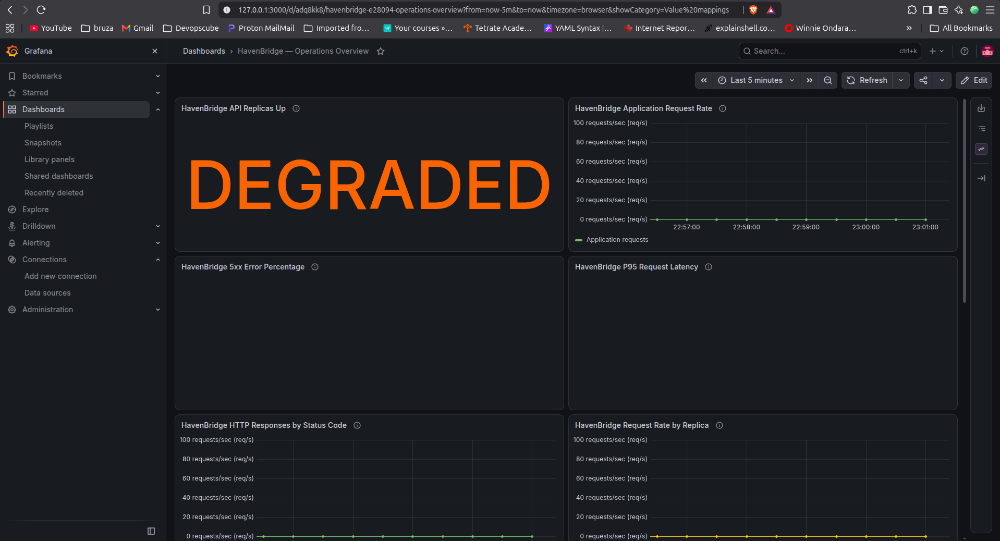

---

### Database Connection Failure in Centralized Logs

Grafana and Loki exposed the SQLAlchemy and psycopg connection failure.

This provided application-level evidence that the Kubernetes symptoms were
caused by database connectivity rather than a generic container failure.

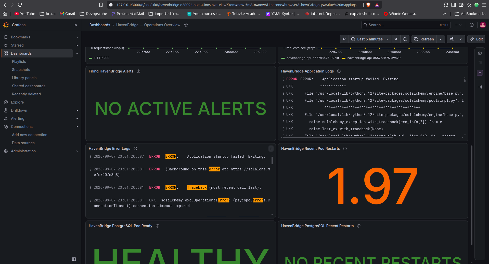

---

### CrashLoop and Restart Evidence

The replacement API Pod repeatedly failed startup and was restarted by
Kubernetes.

Example observed state:

```text
havenbridge-api-d557d8b75-92nkr   1/1 Running
havenbridge-api-d557d8b75-tfgbv   0/1 CrashLoopBackOff
```

The surviving API replica allowed HavenBridge to remain partially available.

The overall API state therefore became:

```text
2 replicas expected
        ↓
1 healthy replica
        ↓
1 failing replica
        ↓
DEGRADED
```

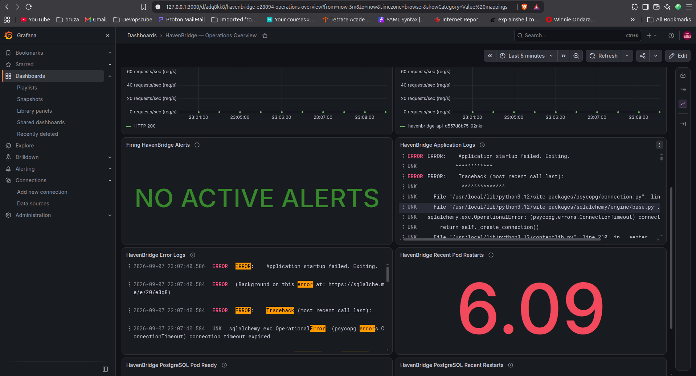

---

### Important Observability Gap

During the incident, the Grafana panel:

```text
HavenBridge PostgreSQL Pod Ready
```

continued to report:

```text
HEALTHY
```

The PostgreSQL Pod itself really was healthy.

However:

```text
API → PostgreSQL connectivity
```

was broken.

This exposed an important difference between:

```text
database Pod health
```

and:

```text
application-to-database connectivity
```

The PostgreSQL Pod readiness metric alone could not detect this failure.

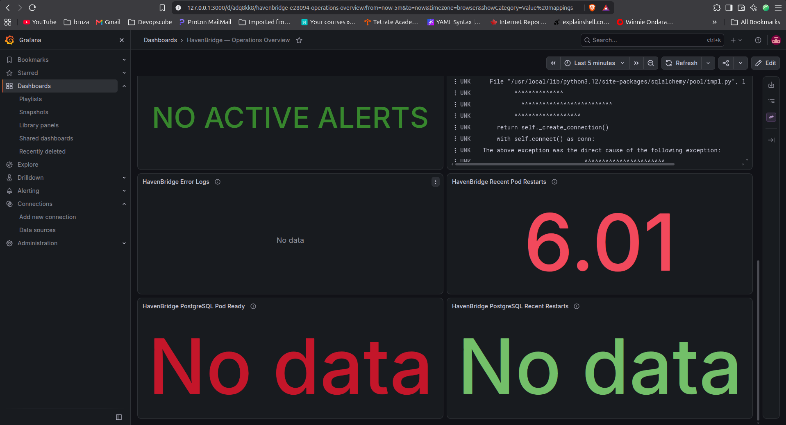

---

### Readiness Endpoint Gap

Another important finding was that:

```text
/health/ready
```

continued returning:

```text
HTTP 200
```

even when a fresh PostgreSQL connection could not be established.

The current readiness endpoint therefore proves:

```text
FastAPI process is available
```

but does not currently prove:

```text
FastAPI can successfully reach PostgreSQL
```

This is an application maturity improvement identified for a later phase.

A future readiness implementation should perform a lightweight database
dependency check so Kubernetes can distinguish:

```text
application process running
```

from:

```text
application actually ready to serve database-backed requests
```

---

### Why No Critical API Alert Fired

The `HavenBridgeAPIUnavailable` alert is designed to fire when all HavenBridge
API targets are unavailable.

During this incident:

```text
one API replica
    → healthy

one API replica
    → CrashLoopBackOff
```

Therefore HavenBridge was degraded, but not completely unavailable.

The alert panel correctly showed:

```text
NO ACTIVE ALERTS
```

This was expected behavior for the current alert design.

---

### Recover PostgreSQL Connectivity

The temporary incident selector was removed from the PostgreSQL Service.

Run on `eph-cp01`:

```bash
kubectl -n havenbridge patch service havenbridge-postgres \
  --type=json \
  -p='[{"op":"remove","path":"/spec/selector/incident"}]'
```

This removed only:

```text
incident=postgres-disconnected
```

and preserved the original PostgreSQL Service selectors.

---

### Validate Endpoint Recovery

Run on `eph-cp01`:

```bash
kubectl -n havenbridge get endpointslice \
  -l kubernetes.io/service-name=havenbridge-postgres \
  -o wide
```

The PostgreSQL endpoint returned:

```text
PORTS       5432
ENDPOINTS   10.244.35.122
```

The restored flow was:

```text
HavenBridge API
        ↓
havenbridge-postgres Service
        ↓
10.244.35.122:5432
        ↓
PostgreSQL Pod
```

---

### API Recovery

The replacement API Pod automatically retried after Kubernetes restarted the
container.

Once PostgreSQL connectivity returned, the application successfully completed
startup.

The Pod changed from:

```text
0/1 CrashLoopBackOff
```

to:

```text
1/1 Running
```

The Deployment was then validated:

```bash
kubectl -n havenbridge get deployment havenbridge-api
```

Result:

```text
READY   UP-TO-DATE   AVAILABLE
2/2     2            2
```

No manual recreation of the Deployment was required.

Kubernetes recovered the failed replica automatically once its dependency
became available again.

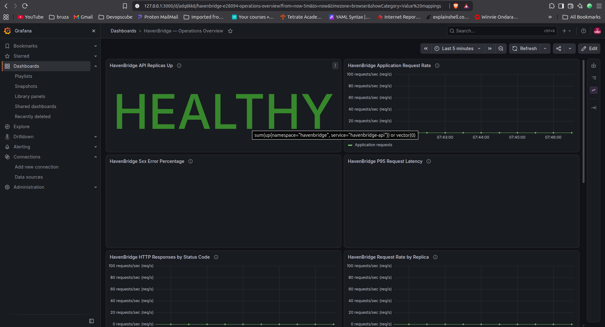

---

### Successful Application Startup After Recovery

Grafana application logs showed successful startup after database connectivity
was restored.

The logs included:

```text
Started server process
Waiting for application startup
Starting HavenBridge API in production
Application startup complete
Uvicorn running on http://0.0.0.0:8000
```

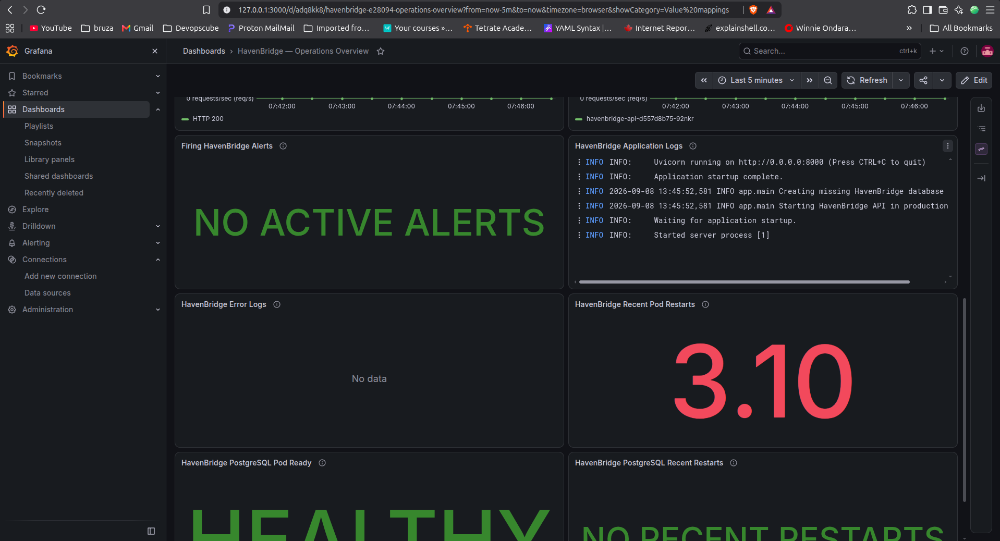

---

### Final Recovery Validation

After recovery:

```text
HavenBridge API Replicas Up
    → HEALTHY

Deployment
    → 2/2

PostgreSQL Pod Ready
    → HEALTHY

PostgreSQL EndpointSlice
    → 10.244.35.122:5432

Firing HavenBridge Alerts
    → NO ACTIVE ALERTS
```

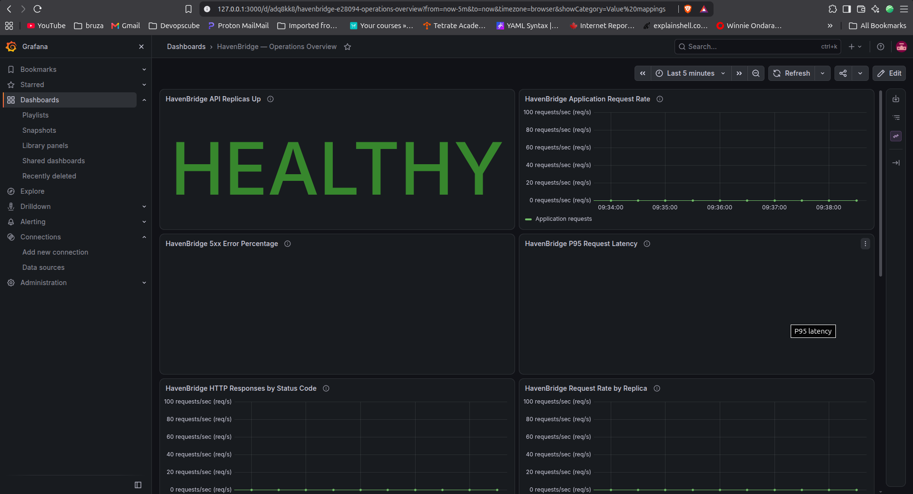

---

### Recent Restart Window Observation

During the incident the:

```text
HavenBridge Recent Pod Restarts
```

panel continued showing restart activity even after application recovery.

The original query used:

```promql
increase(
  kube_pod_container_status_restarts_total[15m]
)
```

The panel therefore answered:

```text
How many HavenBridge container restarts occurred
during the previous 15 minutes?
```

Recovery does not erase restart history immediately.

For example:

```text
application recovered
        ↓
no more restarts occur
        ↓
old restart events still exist inside [15m]
        ↓
Grafana continues displaying recent restart activity
        ↓
events eventually age out
        ↓
panel returns to 0
```

Prometheus `increase()` may also display fractional values such as:

```text
6.09
```

even when Kubernetes reports an integer restart count.

This occurs because Prometheus extrapolates counter increases around scrape
boundaries.

The Kubernetes restart counter remains the authoritative exact cumulative
container restart count.

---

### Restart Window Improvement

For the HavenBridge Operations Overview dashboard, the restart window was
changed from:

```text
15 minutes
```

to:

```text
5 minutes
```

for both:

```text
HavenBridge Recent Pod Restarts
HavenBridge PostgreSQL Recent Restarts
```

The general HavenBridge restart query now uses:

```promql
sum(
  increase(
    kube_pod_container_status_restarts_total{
      namespace="havenbridge"
    }[5m]
  )
) or vector(0)
```

The PostgreSQL-specific restart query now uses:

```promql
sum(
  increase(
    kube_pod_container_status_restarts_total{
      namespace="havenbridge",
      pod=~"havenbridge-postgres-.*"
    }[5m]
  )
) or vector(0)
```

The five-minute window provides a clearer operational view:

```text
active restart problem
    → visible

application recovers
    ↓
five minutes without additional restarts
    ↓
recent failure evidence ages out
    ↓
panel returns to healthy state
```

The cumulative Kubernetes restart count does not reset.

---

### Final Healthy Dashboard State

After more than five minutes without additional API container restarts:

```text
HavenBridge Recent Pod Restarts
    → 0

HavenBridge PostgreSQL Pod Ready
    → HEALTHY

HavenBridge PostgreSQL Recent Restarts
    → NO RECENT RESTARTS

Firing HavenBridge Alerts
    → NO ACTIVE ALERTS
```

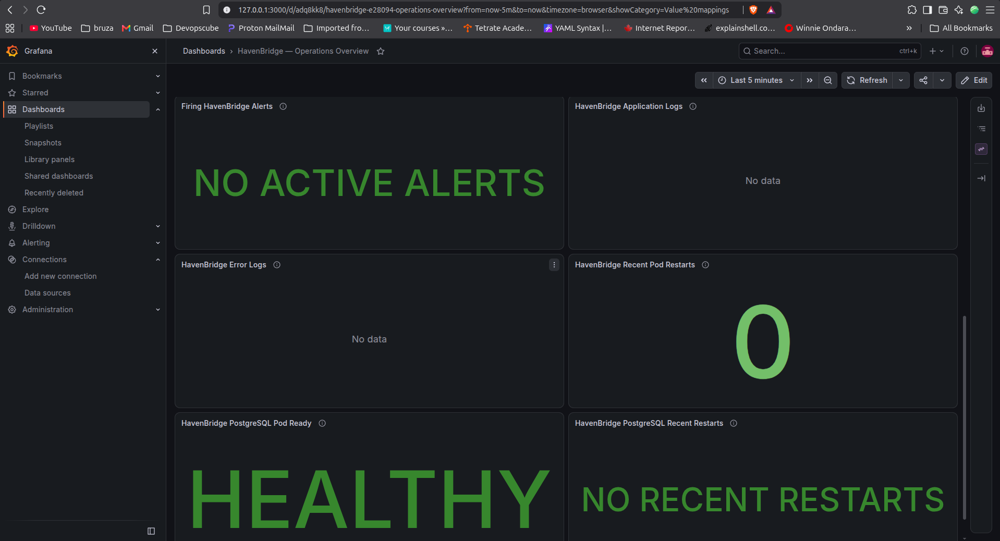

---

### Incident 3 Root Cause

The controlled root cause was:

```text
temporary unmatched selector added
to havenbridge-postgres Service
```

which caused:

```text
PostgreSQL Service
        ↓
no matching Pod
        ↓
EndpointSlice becomes empty
        ↓
new PostgreSQL connections fail
        ↓
replacement API Pod cannot start
        ↓
CrashLoopBackOff
        ↓
HavenBridge operates with one API replica
        ↓
DEGRADED
```

---

### Recovery Summary

```text
Remove temporary Service selector
        ↓
PostgreSQL EndpointSlice repopulates
        ↓
new database connections succeed
        ↓
CrashLooping API replica starts
        ↓
Deployment returns to 2/2
        ↓
Grafana returns to HEALTHY
        ↓
restart events age out of five-minute window
        ↓
Recent Pod Restarts returns to 0
```

---

### Operational Lessons

Incident 3 demonstrated several important production concepts.

1. A healthy PostgreSQL Pod does not guarantee that applications can reach it.

2. Kubernetes Service and EndpointSlice state must be checked when
   troubleshooting application-to-database connectivity.

3. Existing connection pools can temporarily hide a new connectivity failure.

4. Restarting or replacing an application Pod forces a fresh dependency
   connection and may expose an otherwise hidden failure.

5. `CrashLoopBackOff` is a symptom. Application logs revealed the actual cause:
   PostgreSQL connection timeout.

6. One surviving API replica prevented a complete HavenBridge outage.

7. PostgreSQL Pod readiness and API-to-PostgreSQL connectivity are different
   observability signals.

8. The current HavenBridge `/health/ready` endpoint does not validate PostgreSQL
   connectivity and should be improved during a later application-maturity
   phase.

9. Prometheus rolling time windows intentionally preserve recent incident
   evidence after recovery.

10. Kubernetes restart counters are cumulative, while Grafana
    `increase(...[5m])` shows only recent restart activity.

11. Safe incident simulations should disturb the smallest possible component
    and leave persistent storage and application data untouched.

### Incident Result

```text
Incident injection          PASS
PostgreSQL Pod preserved    PASS
Persistent storage safe     PASS
DB connectivity failure     PASS
Fresh connection test       PASS
CrashLoop detected          PASS
Degraded API detected       PASS
Centralized logs detected   PASS
Service recovery            PASS
Endpoint recovery           PASS
API returned to 2/2         PASS
Grafana returned healthy    PASS
```

**Incident 3 — PostgreSQL Connectivity Failure: PASSED**
